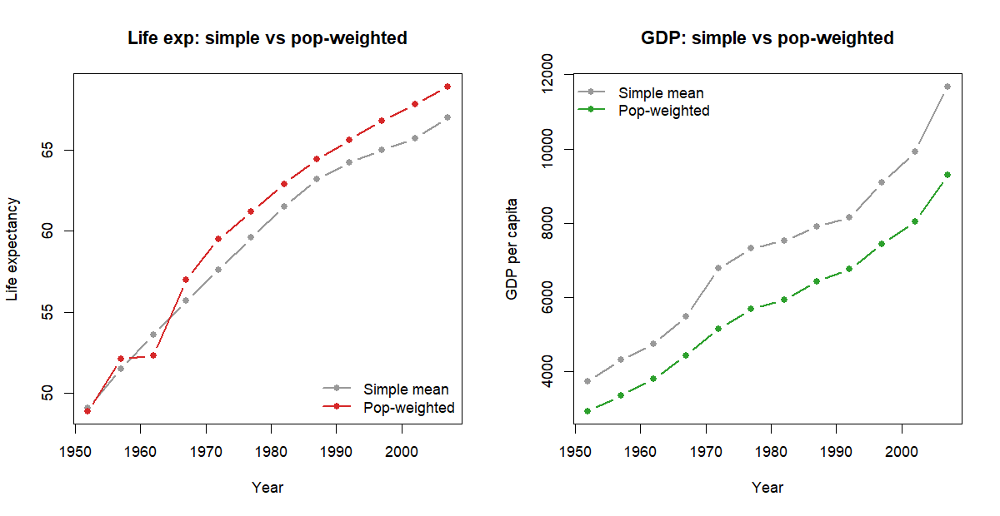
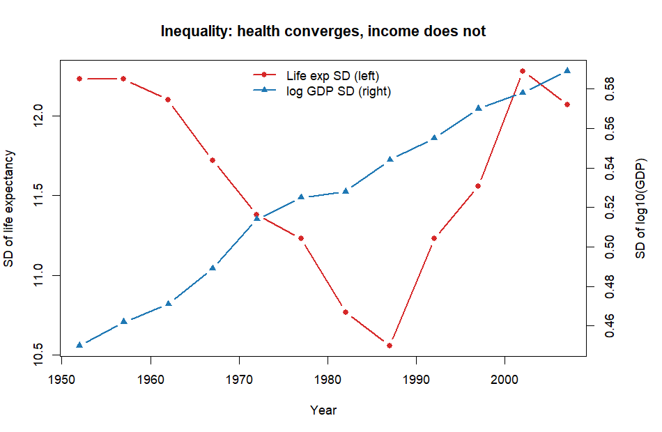
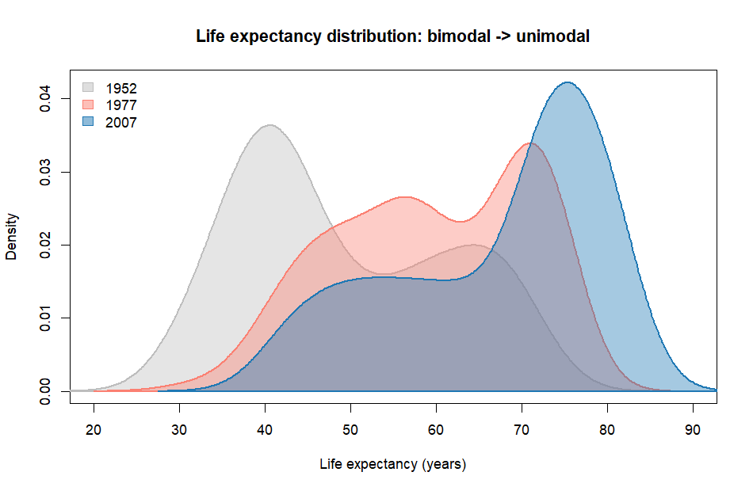
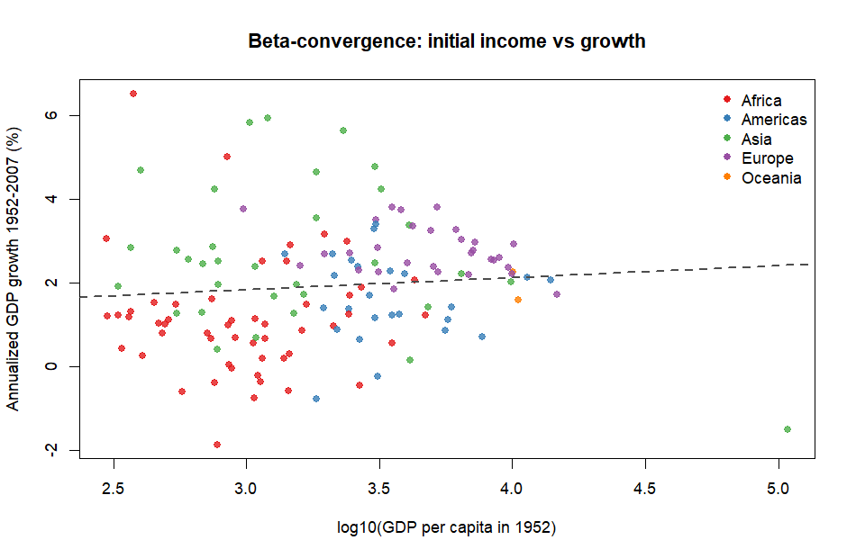
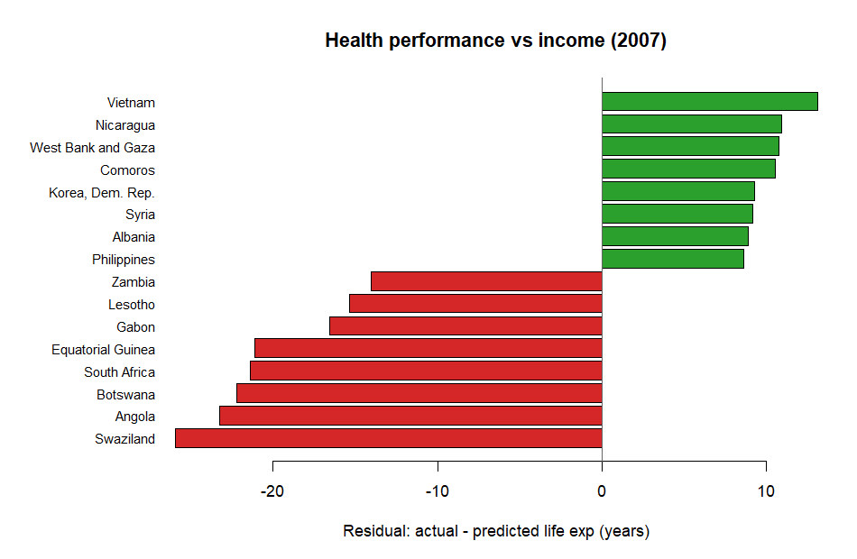
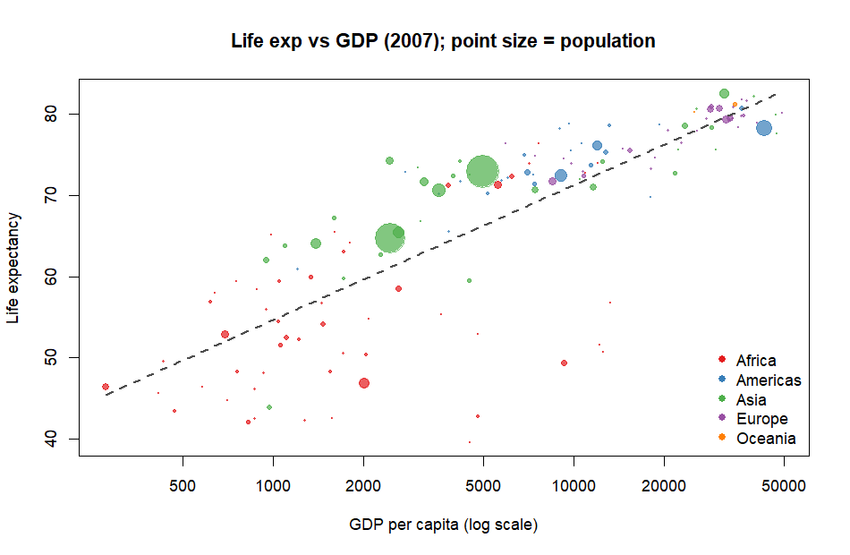
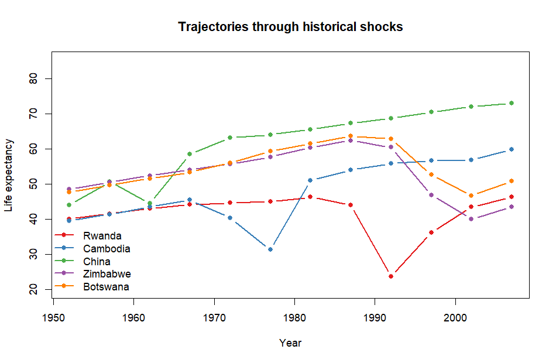
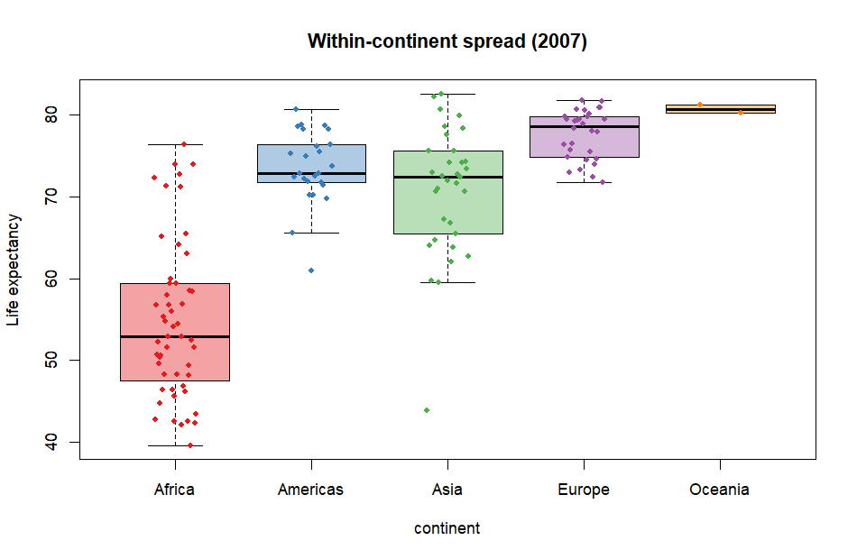

# Gapminder 탐색적 데이터 분석(EDA) 보고서 — 심화판

- **대상 파일:** `data/gapminder.csv`
- **분석 스크립트:** `eda.R`
- **분석일:** 2026-06-27
- **그래프 위치:** `document/figures/`

> **분석 설계 원칙**
> 1. 단순평균이 아닌 **인구가중 통계**를 핵심 지표로 사용 ("평균적인 한 사람"의 경험)
> 2. 분포 형태(왜도·첨도)와 그 **시간적 변화**를 정량화
> 3. 국가 간 불평등의 추이를 **수렴/발산**으로 명시적 측정
> 4. 소득–수명 회귀의 **잔차**로 '성과 초과/미달' 국가 식별
> 5. 역사적 충격(전쟁·기근·질병)을 데이터에서 **자동 탐지**

---

## 핵심 요약 (Executive Summary)

| # | 발견 | 근거 |
|---|------|------|
| 1 | **단순평균은 세계를 낙관적으로 왜곡** | 2007 기대수명 단순 67.0 vs 인구가중 68.9세, GDP 11,680 vs 9,296 |
| 2 | **"건강은 수렴, 소득은 발산"의 비대칭** | 수명 SD 12.23→12.07(↓), log GDP SD 0.450→0.589(↑) |
| 3 | **빈국의 자동 추격(β-수렴)은 없음** | CAGR~log(초기GDP) 기울기 +0.003, p=0.29 (비유의) |
| 4 | **소득으로 설명 안 되는 보건 성과 존재** | 베트남 +13세 초과 / 스와질란드 −26세 미달 (HIV) |
| 5 | **역사적 충격이 데이터에 그대로** | 르완다·캄보디아·이라크·쿠웨이트 등 자동 검출 |
| 6 | **대륙 평균은 내부 이질성을 은폐** | 아시아 내 최부/최빈 GDP 비율 50배 |

---

## 1. 데이터 개요 & 분포 형태 정량화

- 관측치 **1,704** | 국가 **142** | 대륙 **5** | 연도 **12** (1952~2007, 5년 간격)

**분포 형태 (전체 풀링)**

| 변수 | 왜도(skewness) | 초과첨도(excess kurtosis) |
|------|---------------:|--------------------------:|
| lifeExp | −0.252 | −1.127 |
| gdpPercap | **3.847** | **27.432** |
| log10(gdpPercap) | 0.114 | −0.952 |
| pop | 8.333 | 77.716 |
| log10(pop) | 0.077 | 0.477 |

> `gdpPercap`는 극심한 우편향(왜도 3.85)·두꺼운 꼬리(첨도 27)를 보이나, **log 변환 시 거의 대칭화**(왜도 0.11)됨. → 이후 GDP는 로그 척도 사용이 타당.

---

## 2. 단순평균 vs 인구가중평균 — 왜 구분이 중요한가

단순평균은 모든 국가를 동등 취급해 소국을 과대대표한다. 인구가중평균은 **평균적인 한 사람**이 실제로 경험하는 값이다.

| 연도 | 수명(단순) | 수명(가중) | GDP(단순) | GDP(가중) |
|-----:|-----------:|-----------:|----------:|----------:|
| 1952 | 49.1 | 48.9 | 3,725 | 2,924 |
| 1972 | 57.6 | 59.5 | 6,770 | 5,150 |
| 1987 | 63.2 | 64.4 | 7,901 | 6,423 |
| 2007 | 67.0 | **68.9** | 11,680 | **9,296** |

> 2007년 GDP는 인구가중 시 단순평균보다 **약 2,400 낮다.** 거대 인구국(중국·인도)이 중간 소득대에 위치하기 때문. **단순평균은 세계 소득을 실제보다 부풀린다.**
>
> (참고: 수명은 후반으로 갈수록 가중 > 단순인데, 이는 인구 많은 중국·인도가 빠르게 수명을 끌어올렸기 때문)



---

## 3. 국가 간 불평등의 추이 (수렴 vs 발산)

| 연도 | 수명 SD | 수명 P90−P10 | log GDP SD | GDP 지니 | GDP P90/P10 |
|-----:|--------:|-------------:|-----------:|---------:|------------:|
| 1952 | 12.23 | 31.4 | 0.450 | 0.587 | 14.7 |
| 1977 | 11.23 | 29.2 | 0.525 | 0.551 | 25.7 |
| 1992 | 11.23 | 28.3 | 0.555 | 0.565 | 33.6 |
| 2007 | 12.07 | 31.6 | **0.589** | 0.568 | **37.9** |

- **기대수명 SD:** 12.23 → 12.07 → 전반적 **수렴** (1990년대 HIV·체제전환 충격으로 일시 반등)
- **log GDP SD:** 0.450 → 0.589 → **발산 (격차 확대)**. P90/P10 소득배율은 14.7배 → 37.9배로 확대.

> **핵심: "건강 수렴, 소득 발산"의 비대칭.** 보건·의료 기술은 국경을 넘어 빠르게 확산돼 빈국도 수명을 따라잡았지만, 소득 격차는 오히려 고착·심화되었다.



기대수명 분포는 1952년의 **이봉형**(저소득·고소득 두 봉우리)에서 2007년 **단봉형**으로 수렴 — Hans Rosling이 강조한 "세계는 하나의 그룹으로 합쳐지고 있다".



---

## 4. β-수렴 분석 — 가난한 나라가 더 빨리 성장했는가?

국가별 1952→2007 GDP 연평균성장률(CAGR)을 초기 소득에 회귀. 기울기 < 0 이면 빈국이 더 빨리 성장(절대수렴).

```
회귀: CAGR ~ log10(초기 GDP)
  기울기 = +0.0029 (p = 0.286), R² = 0.008
```

> 기울기가 양수이고 **통계적으로 유의하지 않음** → **절대수렴의 증거 없음.** 초기 소득만으로는 성장을 설명하지 못한다(R²<0.01). 즉 빈국이 자동으로 따라잡지 않으며, 성패는 국가별 제도·정책에 달려 있음.

| 성장 챔피언 (CAGR↑) | 대륙 | 1952 GDP | 2007 GDP | CAGR |
|----|----|---------:|---------:|-----:|
| Equatorial Guinea | Africa | 376 | 12,154 | 6.5% |
| Taiwan | Asia | 1,207 | 28,718 | 5.9% |
| Korea, Rep. | Asia | 1,031 | 23,348 | 5.8% |
| Singapore | Asia | 2,315 | 47,143 | 5.6% |
| Botswana | Africa | 851 | 12,570 | 5.0% |

| 성장 후퇴 (CAGR↓) | 대륙 | 1952 GDP | 2007 GDP | CAGR |
|----|----|---------:|---------:|-----:|
| Congo, Dem. Rep. | Africa | 781 | 278 | −1.9% |
| Kuwait | Asia | 108,382 | 47,307 | −1.5% |
| Haiti | Americas | 1,840 | 1,202 | −0.8% |
| Central African Rep. | Africa | 1,071 | 706 | −0.8% |
| Liberia | Africa | 576 | 415 | −0.6% |



---

## 5. 소득–수명 관계의 시간적 변화 & 회귀 잔차

**연도별 상관계수 corr(lifeExp, log10 GDP)**

| 1952 | 1972 | 1987 | 1997 | 2007 |
|-----:|-----:|-----:|-----:|-----:|
| 0.748 | 0.789 | **0.874** | 0.864 | 0.809 |

> 상관은 1987년 0.87로 정점 후 소폭 약화. 2007년에도 소득이 수명 분산의 **65%(R²=0.654)**를 설명하나, 나머지 35%는 소득 외 요인(보건정책·전염병·분쟁).

**2007년 회귀 잔차 = 소득 대비 성과**

| 초과 성과 (잔차 +) | 대륙 | GDP | 실제 수명 | 잔차 |
|----|----|----:|----:|----:|
| Vietnam | Asia | 2,442 | 74.2 | +13.1 |
| Nicaragua | Americas | 2,749 | 72.9 | +10.9 |
| West Bank and Gaza | Asia | 3,025 | 73.4 | +10.7 |

| 미달 (잔차 −) | 대륙 | GDP | 실제 수명 | 잔차 |
|----|----|----:|----:|----:|
| Swaziland | Africa | 4,513 | 39.6 | −25.9 |
| Angola | Africa | 4,797 | 42.7 | −23.3 |
| Botswana | Africa | 12,570 | 50.7 | −22.2 |
| South Africa | Africa | 9,270 | 49.3 | −21.4 |

> **잔차 +**: 저소득에도 장수 → 보건 효율 높음(베트남·쿠바형). **잔차 −**: 중소득인데 단명 → 남부아프리카에 집중된 **HIV/AIDS의 통계적 지문**.




---

## 6. 역사적 충격 자동 탐지 (연속 시점 간 급락)

**기대수명 최대 급락**

| 국가 | 연도 | 수명 | 5년 변화 | 추정 원인 |
|------|-----:|----:|---------:|-----------|
| Rwanda | 1992 | 23.6 | **−20.4** | 1994 제노사이드 |
| Zimbabwe | 1997 | 46.8 | −13.6 | HIV/AIDS |
| Lesotho | 2002 | 44.6 | −11.0 | HIV/AIDS |
| Swaziland | 2002 | 43.9 | −10.4 | HIV/AIDS |
| Cambodia | 1977 | 31.2 | −9.1 | 크메르루주 |

**1인당 GDP 최대 급락**

| 국가 | 연도 | GDP | 변화율 | 추정 원인 |
|------|-----:|----:|------:|-----------|
| Iraq | 1992 | 3,746 | −67.8% | 걸프전 |
| Korea, Dem. Rep. | 1997 | 1,691 | −54.6% | 경제 붕괴·기근 |
| Kuwait | 1982 | 31,354 | −47.1% | 유가/생산 충격 |
| Sierra Leone | 1997 | 575 | −46.2% | 내전 |

> 자동 검출된 이상치가 실제 역사적 사건과 정확히 일치 → 데이터의 신뢰성과 분석 방법의 타당성을 동시에 확인.



---

## 7. 대륙 내 이질성 — 평균이 숨기는 분산 (2007)

| 대륙 | 국가수 | 수명 최소 | 수명 중앙 | 수명 최대 | GDP 최대/최소 |
|------|-----:|--------:|--------:|--------:|------------:|
| Africa | 52 | 39.6 | 52.9 | 76.4 | 47.6 |
| Americas | 25 | 60.9 | 72.9 | 80.7 | 35.7 |
| Asia | 33 | 43.8 | 72.4 | 82.6 | **50.1** |
| Europe | 30 | 71.8 | 78.6 | 81.8 | 8.3 |
| Oceania | 2 | 80.2 | 80.7 | 81.2 | 1.4 |

> 아시아는 내부 소득격차가 **50배**로 가장 극심(일본·쿠웨이트 ↔ 아프가니스탄·미얀마). "아시아 평균" 같은 대륙 단위 요약은 분석적 가치가 거의 없음. 반면 유럽은 동질적(8배).



---

## 8. 종합 결론

1. **방법론적 교훈** — 세계 추세를 볼 때 단순평균은 소국을 과대대표하여 낙관적으로 왜곡한다. 인구가중 통계가 "평균적 인간"을 더 정확히 대변한다.
2. **건강 수렴 / 소득 발산** — 1952~2007년 기대수명 격차는 줄었으나(보건기술 확산) 소득 격차는 확대되었다. 두 차원은 다르게 움직인다.
3. **자동 추격은 없다** — β-수렴이 관측되지 않으며, 한국·대만 등 '추격 성공'과 콩고·아이티 등 '후퇴'가 공존한다. 성장은 운명이 아니라 제도·정책의 산물.
4. **소득 너머의 건강** — 소득은 수명의 65%를 설명하지만, 베트남(초과)·남부아프리카(미달, HIV)처럼 보건정책·전염병이 나머지를 좌우한다.
5. **집계 수준 주의** — 대륙 평균은 내부 이질성(특히 아시아)을 은폐하므로, 국가 단위 또는 분포 기반 분석이 필요하다.

### 분석 한계 및 향후 과제
- 데이터는 5년 간격·2007년까지 → 최근 추세(코로나 등) 미포함.
- gdpPercap는 명목/실질·PPP 기준 문서화가 제한적 → 절대 수준 해석에 주의.
- 인과 분석이 아닌 기술·상관 분석 → 정책 효과 추론에는 추가 식별전략 필요.
